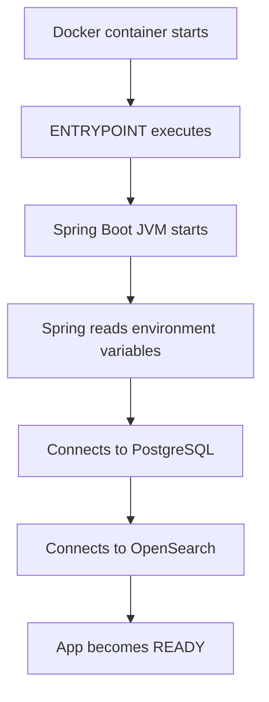

# Sell-the-old-Car Backend

The backend service for the "Sell-the-old-Car" application, a robust marketplace for buying and selling used cars. This application is built with Java and Spring Boot, utilizing a hybrid REST and GraphQL API architecture.

## 🚀 Tech Stack

- **Core Framework**: Java 21+, Spring Boot 3.x
- **API**: 
  - GraphQL (schema defined in `schema.graphqls`)
  - REST Controllers (for file uploads, specific integrations)
- **Database**: PostgreSQL
- **Search Engine**: OpenSearch
- **Caching**: Redis
- **Containerization**: Docker & Docker Compose
- **Build Tool**: Gradle

## ✨ Key Features

- **User Authentication**: Secure JWT-based authentication with `CustomUserDetailsService`.
- **Car Management**: Comprehensive usage of relational data and search indexing for car listings.
- **Real-time Chat**: Messaging system for buyers and sellers (referenced in `ChatMessageController`).
- **Dealer Verification**: Processes for validating dealer credentials.
- **Media Management**: Support for uploading and managing car images/videos (Backblaze B2 integration).
- **Observability**: Structured logging and monitoring ready.

## 🛠️ Getting Started

### Prerequisites

- JVM (Java 21 or higher)
- Docker Desktop (for running dependencies)
- Git

### Running Local Infrastructure

Use Docker Compose to spin up the required databases and services:

```bash
docker-compose up -d
```

Validates that PostgreSQL, Redis, and OpenSearch are running.

### Application Setup

1.  **Clone the repository**:
    ```bash
    git clone <repository-url>
    ```

2.  **Environment Configuration**:
    Copy `.env.example` to `.env` (if available) or ensure `application.yml` is configured with your local database credentials.

3.  **Build and Run**:
    ```bash
    ./gradlew bootRun
    ```

The application will start on port `9000` (default).

### Application Startup Lifecycle

The following flow describes how the application initializes in a Docker environment:



1.  **Container Start**: Docker initializes the container.
2.  **Entrypoint**: The Java application is launched via the configured entrypoint.
3.  **Bootstrapping**: Spring Boot starts the JVM and loads the application context.
4.  **Configuration**: the application reads `application.yml` and environment variables (e.g., `DB_URL`, `OPENSEARCH_HOST`).
5.  **Database Connection**: A connection is established to the PostgreSQL database.
6.  **Search Engine Connection**: The application connects to the OpenSearch cluster.
7.  **Ready State**: Once all dependencies are validated, the application accepts traffic.

## 📚 API Documentation

- **GraphQL Playground**: Accessible at `/graphiql` (if enabled in dev profile).
- **Swagger UI**: Accessible at `/swagger-ui.html` (for REST endpoints).

## 🤝 Contributing

1.  Fork the repository.
2.  Create a feature branch (`git checkout -b feature/amazing-feature`).
3.  Commit your changes (`git commit -m 'Add amazing feature'`).
4.  Push to the branch (`git push origin feature/amazing-feature`).
5.  Open a Pull Request.
